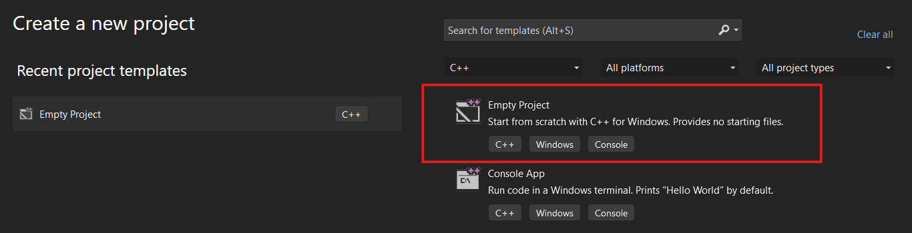
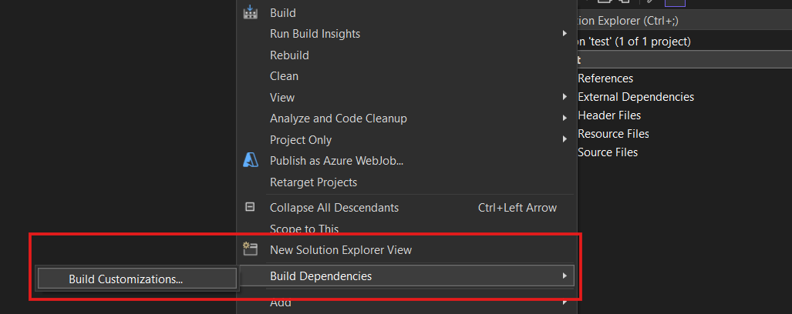
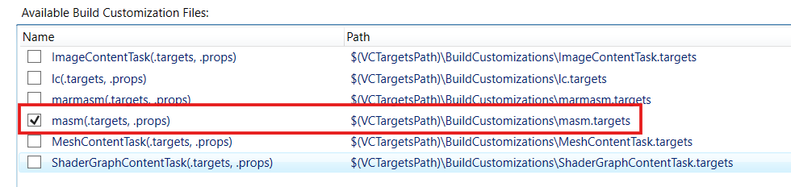
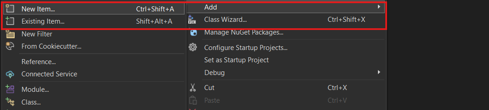
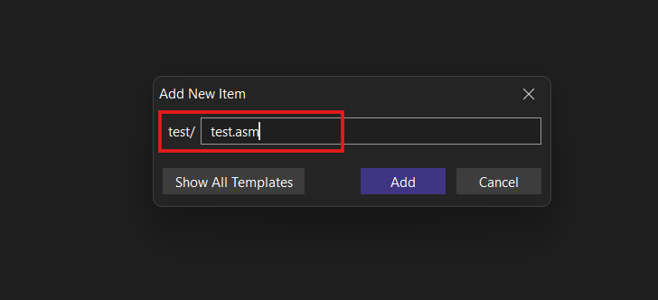
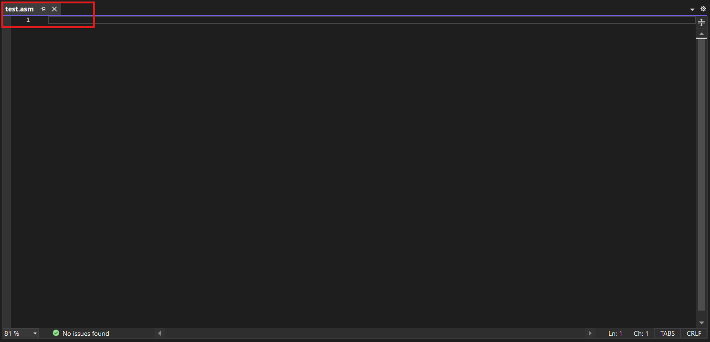

# Assembly Code Dump
Here are some of the assembly scripts I wrote...

## HOW TO RUN THESE SCRIPTS:

**STEP 1:** Open up your Visual Studio 2022 (or any)

**STEP 2:** Now go to the `Creat New Project Menu`.

**STEP 3:** In the Language section choose `C++` and then choose `Empty Project`.

**STEP 4:** In the `Project` section, first right click then from the `Build Dependencies` section choose `Build Customization`.

**STEP 5:** Now click the `masm` check box.

**STEP 6:** After checking the check box again right click in the `Project` section and from the `Add` section choose `New Item`.

**STEP 7:** Write the file name as follow and make sure to use `.asm` extension.

**STEP 8:** After this you'll have your code editor ready.

Use **https://godbolt.org/** for better understanding.
