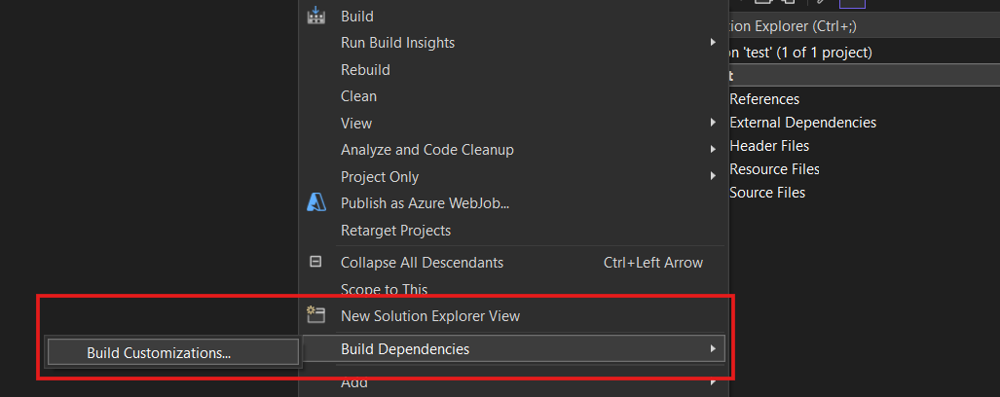

# Assembly Code Dump
Here some of the assembly scripts I wrote...

## How TO RUN THESE SCRIPTS:

**STEP 1:** Open up your Visual Studio 2022 (or any)

**STEP 2:** Now go to the `Creat New Project Menu`.

**STEP 3:** In the Language section choose `C++` and then choose `Empty Project`.

